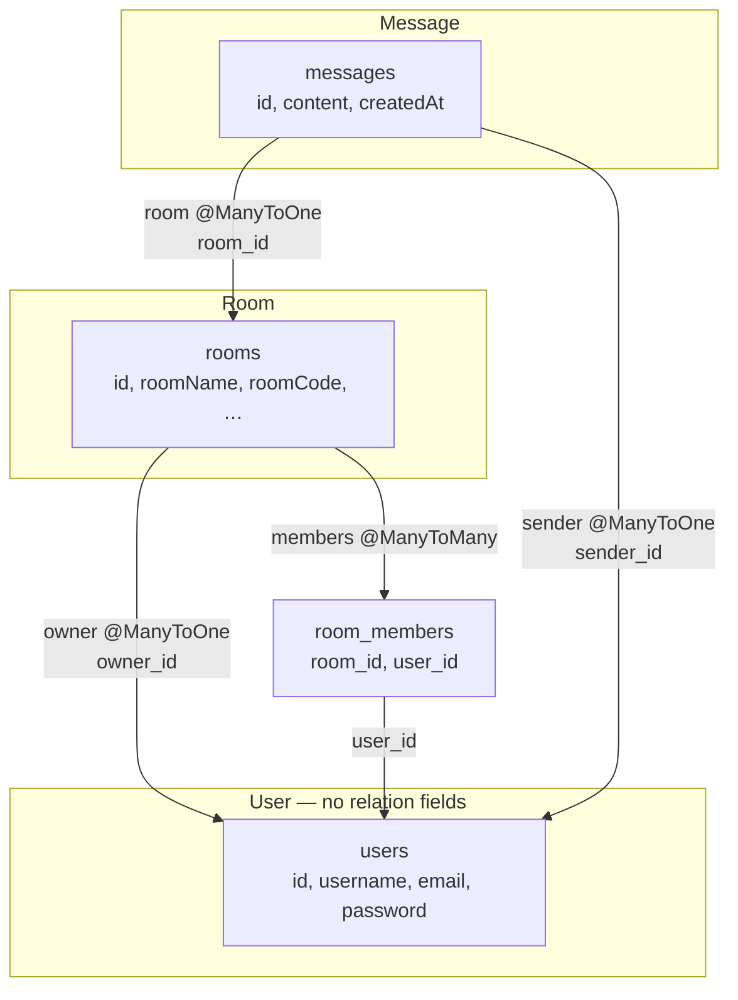
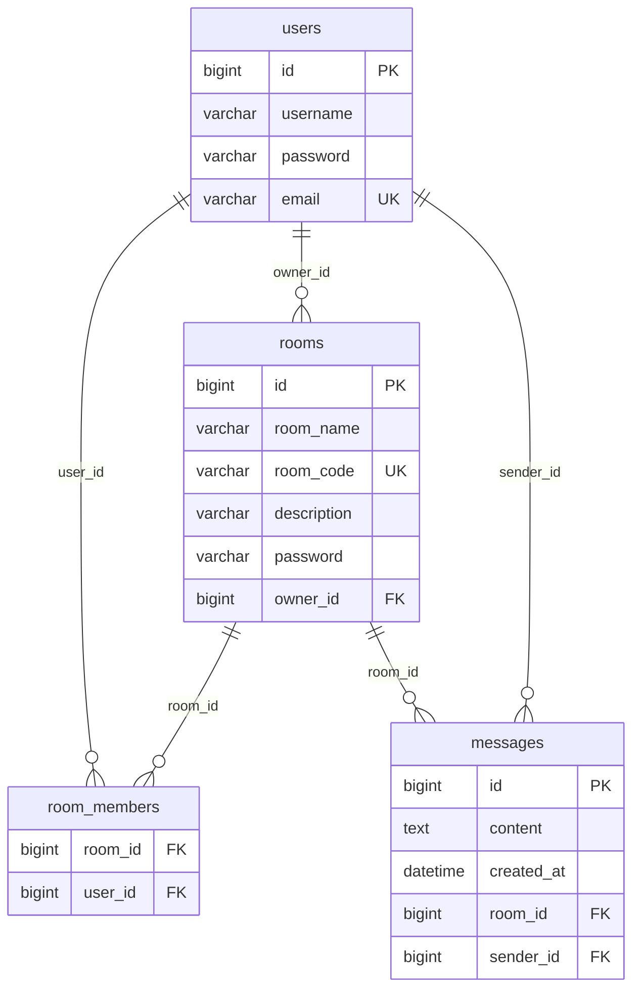

# Entity Relations — Online Study Meeting Rooms

All relations are **unidirectional**: each link is defined on one entity only. There are no `mappedBy` inverse collections.

## Overview

| Entity   | Table          | Role                                      |
|----------|----------------|-------------------------------------------|
| `User`   | `users`        | Registered account                        |
| `Room`   | `rooms`        | Study/meeting room                        |
| `Message`| `messages`     | Chat message inside a room                |

Join table (no entity class):

| Table           | Role                              |
|-----------------|-----------------------------------|
| `room_members`  | Links users who joined a room     |

Schema is managed by Hibernate (`spring.jpa.hibernate.ddl-auto=update`) against MySQL database `study_online_db`.

---

## Entity Relationship Diagram

### Unidirectional view (JPA fields)

Arrows follow the entity that **defines** the relation (`Room.owner` → `User`, not the reverse).



### Database view (tables + foreign keys)



### ASCII sketch

```
                    ┌──────────────┐
                    │     User     │  ← no outgoing relations
                    │   (users)    │
                    └──────▲───────┘
                           │
          owner_id         │ sender_id
              ┌────────────┼────────────┐
              │            │            │
       ┌──────┴─────┐  ┌───┴────┐  ┌────┴─────┐
       │    Room    │  │ room_  │  │ Message  │
       │  (rooms)   │──│ members│  │(messages)│
       └──────▲─────┘  └────────┘  └──────────┘
              │                          │
              └──────── room_id ─────────┘

Room.owner      → User
Room.members    → User   (via room_members)
Message.room    → Room
Message.sender  → User
```

---

## Relations in Detail

### 1. Room → User (owner)

Defined on `Room` only.

| Entity | Field   | Annotation                               |
|--------|---------|------------------------------------------|
| `Room` | `owner` | `@ManyToOne` → `@JoinColumn(owner_id)`   |

**Foreign key:** `rooms.owner_id` → `users.id`

**Example:**

```java
Room room = new Room();
room.setOwner(currentUser);
room.setRoomName("Math study group");
roomRepository.save(room);
```

**Query rooms owned by a user** (no field on `User`):

```java
roomRepository.findByOwnerId(userId);
```

---

### 2. Room → User (members)

Defined on `Room` only.

| Entity | Field     | Annotation                                      |
|--------|-----------|-------------------------------------------------|
| `Room` | `members` | `@ManyToMany` + `@JoinTable(name = "room_members")` |

**Join table:** `room_members`

| Column     | References   |
|------------|--------------|
| `room_id`  | `rooms.id`   |
| `user_id`  | `users.id`   |

**Example:**

```java
room.getMembers().add(user);
roomRepository.save(room);
```

**Query rooms a user joined** (no field on `User`):

```java
roomRepository.findByMembersId(userId);
```

---

### 3. Message → Room

Defined on `Message` only.

| Entity    | Field  | Annotation                            |
|-----------|--------|---------------------------------------|
| `Message` | `room` | `@ManyToOne` → `@JoinColumn(room_id)` |

**Foreign key:** `messages.room_id` → `rooms.id`

**Example:**

```java
Message message = new Message();
message.setContent("Hello everyone");
message.setRoom(room);
message.setSender(currentUser);
messageRepository.save(message);
```

**Query messages in a room** (no field on `Room`):

```java
messageRepository.findByRoomIdOrderByCreatedAtAsc(roomId);
```

---

### 4. Message → User (sender)

Defined on `Message` only.

| Entity    | Field    | Annotation                               |
|-----------|----------|------------------------------------------|
| `Message` | `sender` | `@ManyToOne` → `@JoinColumn(sender_id)`  |

**Foreign key:** `messages.sender_id` → `users.id`

**Example:**

```java
Message message = new Message();
message.setSender(user);
message.setRoom(room);
message.setContent("Can we review chapter 3?");
messageRepository.save(message);
```

---

## Summary Table

| Defined on  | Points to | Type        | FK / Join            |
|-------------|-----------|-------------|----------------------|
| `Room`      | `User`    | Many-to-One | `rooms.owner_id`     |
| `Room`      | `User`    | Many-to-Many| `room_members`       |
| `Message`   | `Room`    | Many-to-One | `messages.room_id`   |
| `Message`   | `User`    | Many-to-One | `messages.sender_id` |

`User` has no relation fields — only `id`, `username`, `password`, `email`.

---

## Entity Files

| Entity    | Java class | Repository            |
|-----------|------------|-----------------------|
| `User`    | `Model/User.java`    | `UserRepository`    |
| `Room`    | `Model/Room.java`    | `RoomRepository`    |
| `Message` | `Model/Message.java` | `MessageRepository` |

---

## Practical Notes

1. **Unidirectional only:** Set the relation on the entity that owns the foreign key or join table. Do not maintain two sides of the same link.

2. **Reverse lookups:** Use repository query methods instead of inverse collections (e.g. `findByOwnerId`, `findByRoomIdOrderByCreatedAtAsc`).

3. **JSON serialization:** Fewer back-references means fewer infinite-loop risks, but still use DTOs when returning entities in REST APIs.

4. **Lazy loading:** `@ManyToOne` on `Message` and `Room` defaults to eager; `@ManyToMany` on `Room.members` is lazy. Use `@Transactional` in services when loading collections.

5. **Timestamps:** `Message.createdAt` uses `LocalDateTime` and is set automatically by `@CreationTimestamp` on insert.

6. **Not relations:** `User.password`, `Room.password`, and `Room.description` are plain columns, not links to other tables.
